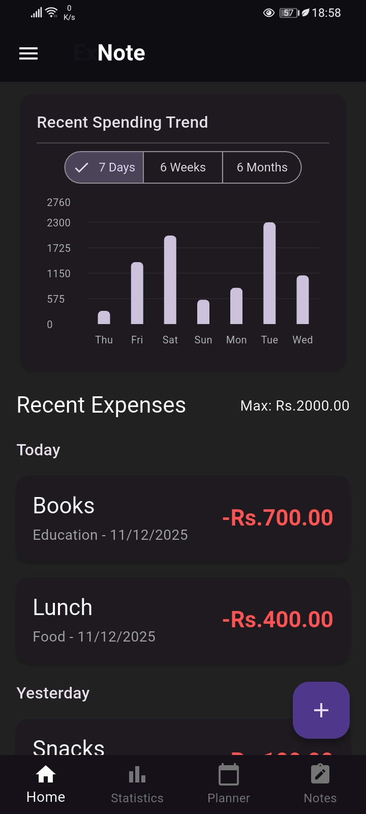
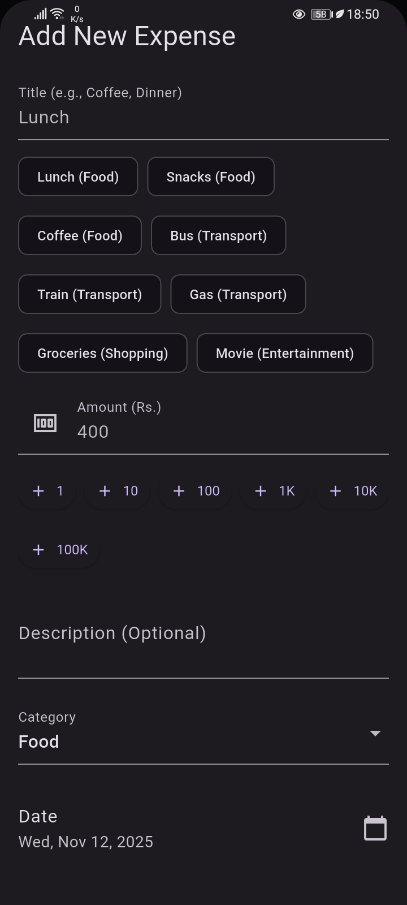
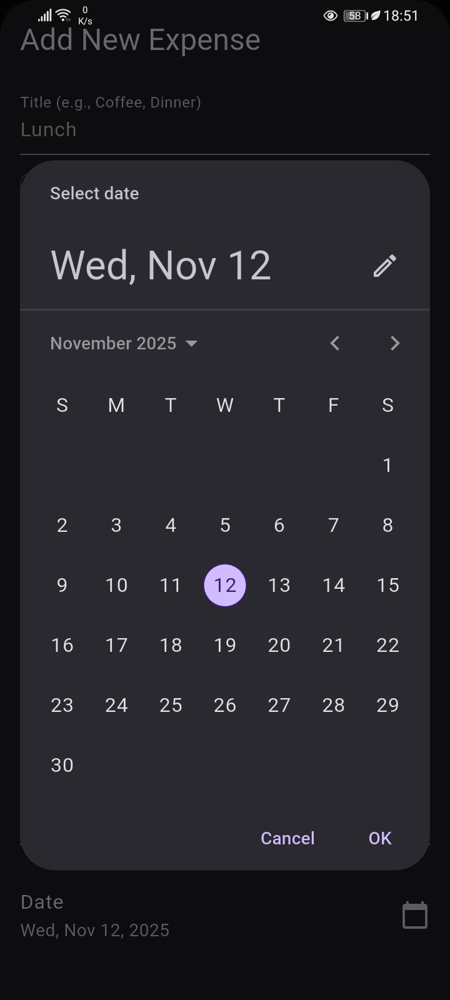
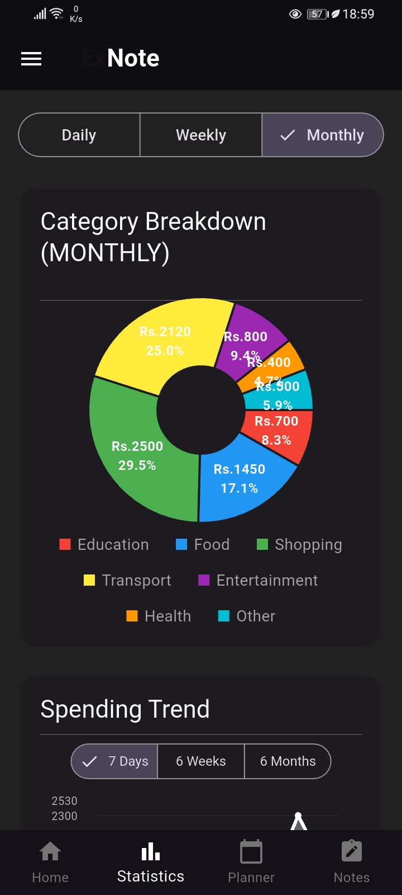
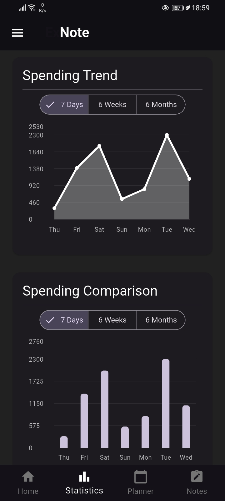
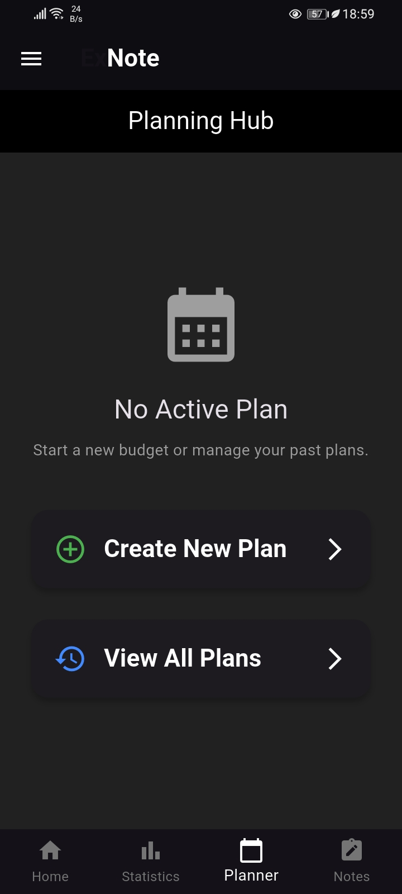
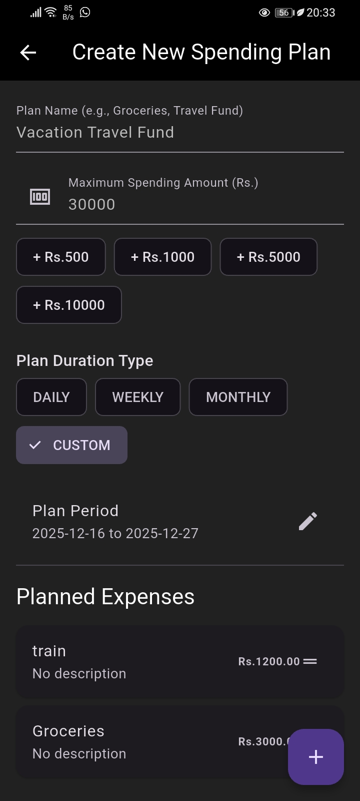
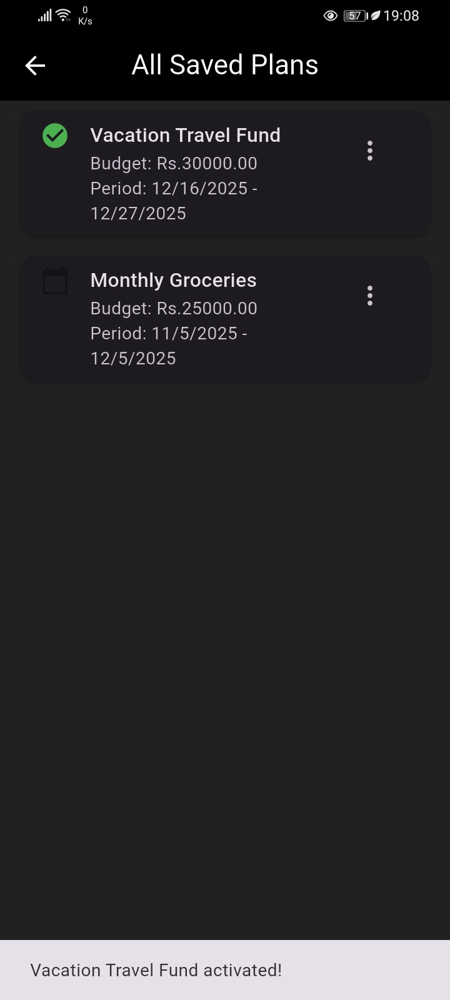
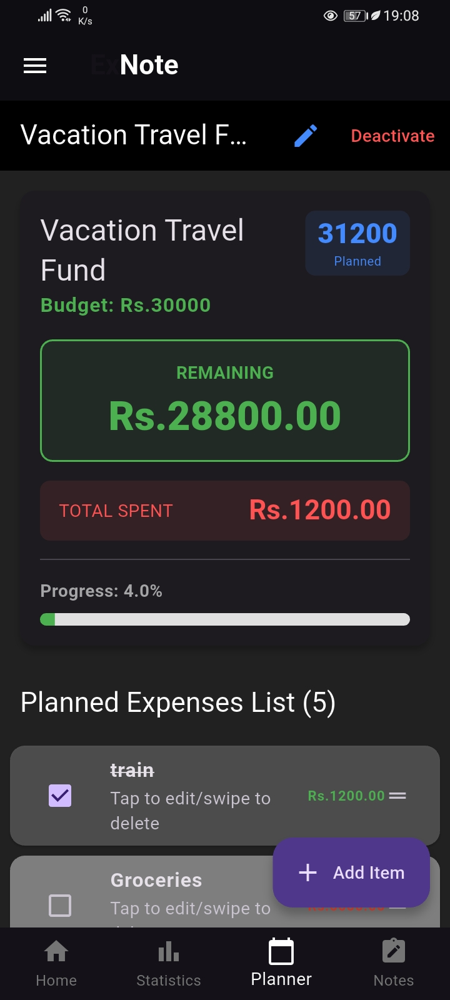
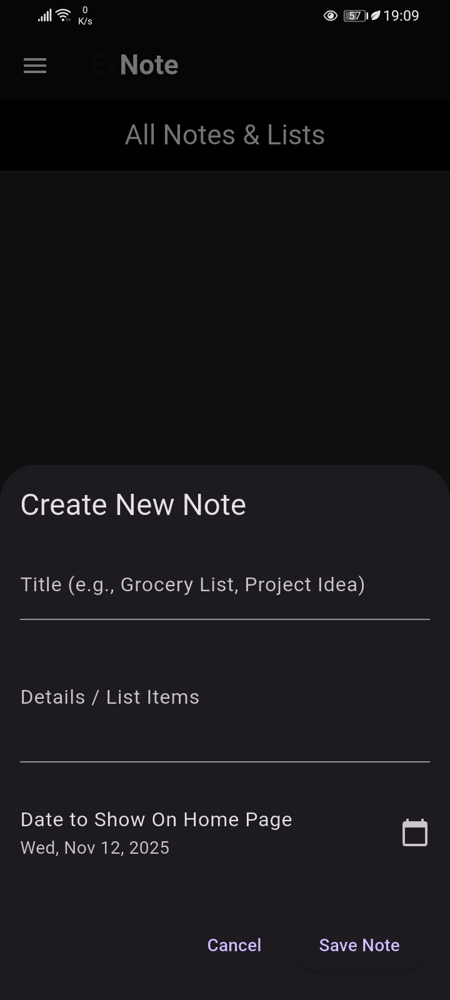

# ExNote: Expense Tracker & Financial Planner

An intuitive and elegant mobile application built with Flutter to help you track your daily expenses, plan your budget, and visualize your spending habits.

## Features
* **Expense Management:** Add, edit, and delete daily expenses quickly.
* **Category Breakdown:** See where your money goes with clear **Pie Charts** and Category Totals.
* **Spending Visualization:** Interactive charts including **Line Charts** for trend analysis and **Bar Charts** for period comparison.
* **Planning & Notes:** Dedicated sections for setting financial goals and jotting down related reminders or grocery lists.
* **Modern UI:** Clean, material-inspired design with full **Light and Dark Mode** support.

# Screenshots
## Home Page
<table>
  <tr>
    <td align="center">
      <h3>Home Page</h3>
      
    </td>
    <td align="center">
      <h3>Add Expense</h3>
      
    </td>
    <td align="center">
      <h3>Select the Date</h3>
      
    </td>
  </tr>
</table>

## Statistics Page
<table>
  <tr>
    <td align="center">
      <h3>Pie Chart</h3>
      
    </td>
    <td align="center">
      <h3>Line Chart and Bar Chart</h3>
      
    </td>
  </tr>
</table>

## Planner Page
<table>
  <tr>
    <td align="center">
      <h3>Create a Plan</h3>
      
    </td>
    <td align="center">
      <h3>Add Details</h3>
      
    </td>
    <td align="center">
      <h3>Choose the timeline</h3>
      
    </td>
    </tr>
</table>
<table>
    <td align="center">
      <h3>Saved Plans</h3>
      
    </td>
    <td align="center">
      <h3>Active Plan</h3>
      
    </td>
  </tr>
</table>

## Note Page
<table>
  <tr>
    <td align="center">
      <h3>Create Notes</h3>
      
    </td>
    </tr>
</table>

## Installation & Download

### Android (APK)

The latest release can be downloaded directly from the GitHub **[Releases page](https://github.com/HirushaReshan/ExNote/releases)**.

1.  Download the **`ExNote_release_version.apk`** file.
2.  Install it directly on your Android device.

## Technologies Used

* **Framework:** [Flutter](https://flutter.dev/) (Dart)
* **State Management:** `provider`
* **Database:** `sqflite` (or `hive`/`moor` - *Adjust this based on what you used*)
* **Charting:** `fl_chart`
* **Date/Time:** `intl`

## Contributing

Since this was a personal project, any feedback, bug reports, or feature suggestions are welcome!

1.  Fork the repository.
2.  Create your feature branch (`git checkout -b feature/Your_Feature`).
3.  Commit your changes (`git commit -m 'Add some Your_Feature'`).
4.  Push to the branch (`git push origin feature/Your_Feature`).
5.  Open a Pull Request.

## Contact

Hirusha - [LinkedIn](https://www.linkedin.com/in/hirusha-reshan-425930365)

## Project Link: 
https://github.com/HirushaReshan/ExNote
